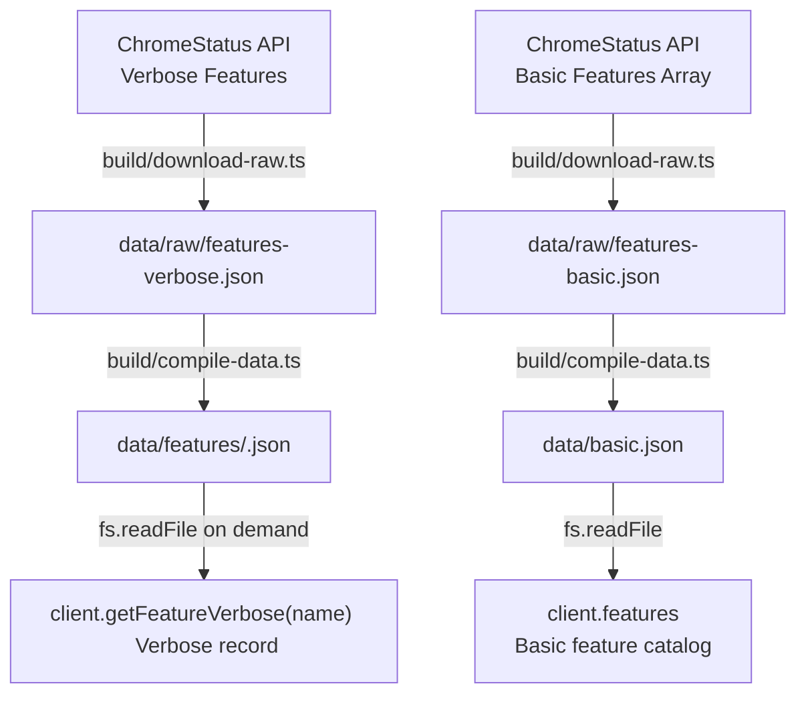

# ChromeStatus Payload Architecture & Package Mapping

This document details the underlying API endpoints exposed by **ChromeStatus.com** (backed by the open-source [chromium-dashboard](https://github.com/GoogleChrome/chromium-dashboard) service), analyzes their structural verbosity differences, and explains how the `@paulirish/chromestatus` package leverages these behaviors to deliver optimal client-side consumption.

---

## 1. Live Service Endpoints Reference

### Core Search & List
* **Endpoint:** `GET /api/v0/features`
* **Query Modifiers:**
  * `q` *(string)*: Arbitrary structured or full-text query filter (e.g., `owner:me`, `category:Graphics`, `feature_type<=1`).
  * `num` *(integer)*: Results limit per page. Strictly capped at `1000` by the backend datastore configuration.
  * `start` *(integer)*: Pagination offset.
  * `milestone` *(integer)*: Override parameter retrieving features scheduled for a specific milestone grouped by roadmap reasons.
  * `name_only` *(boolean)*: Emits minimal identifier stubs (`id`, `name`, permissions) to conserve bandwidth.
* **Backend Mechanism:** When queried with a non-empty search term (`q`), request routing delegates to `search.process_query()`. This internally resolves matching entities using `feature_helpers.get_by_ids()`, which explicitly formats records using the absolute **verbose JSON converter** (`converters.feature_entry_to_json_verbose()`).

### Single Feature Lookup
* **Endpoint:** `GET /api/v0/features/<int:feature_id>`
* **Backend Mechanism:** Delegates directly to `get_one_feature()`, returning the identical **verbose JSON converter** representation.

### Legacy Unpaginated Feeds
* **Endpoints:** `GET /features.json` and `GET /features_v2.json`
* **Backend Mechanism:** Calls `feature_helpers.get_features_by_impl_status()`. This loops through all implementation statuses and outputs basic feature objects formatted via the lightweight **basic JSON converter** (`converters.feature_entry_to_json_basic()`).

---

## 2. Basic vs. Verbose Payload Comparison

Comparative evaluation of basic vs. verbose outputs reveals significant differences in footprint and property depth across the **3,566 features** in the catalog:

| Metric | Verbose Features | Basic Features |
| :--- | :--- | :--- |
| **Source Endpoint** | `/api/v0/features?num=1000` (Iterated) | `/features.json` |
| **Monolithic File Size** | **~61 MB** | **~9.5 MB** |
| **Average Top-Level Keys** | **105 keys** | **22 keys** |
| **Exclusive Keys** | **85 keys** | **2 keys** (`milestone`, `owners`) |
| **Embedded `stages` Array** | **100% populated** (3,566 records) | **Stripped entirely** |
| **Rich Text Retention** | Preserves `motivation`, `explainer_links`, `devrel_emails` | Stripped entirely |

> **Note on Origin Trial Extensions:** In verbose payloads, Origin Trial stage entities (`stage_type === 150`, `250`, or `450`) embed subsequent trial extension stages in their `extensions` array property.

---

## 3. Ecosystem Linkage & Mapping Fidelity

Feature records frequently populate a string identifier in the `web_feature` field to link external ecosystem specifications.

Validation against the authoritative **`web-features`** npm package:
* **Populated Scope**: 2,185 out of 3,566 records contain a `web_feature` string.
* **Placeholders**: 143 records contain a literal placeholder string (`"Missing feature"`), leaving **2,042 valid web feature IDs**.
* **Mapping Fidelity**: **2,021 out of 2,042 identifiers map directly to top-level keys in `web-features`** (e.g., `"canvas"`, `"webgpu"`, `"view-transitions"`), representing **98.97% direct mapping accuracy**.

---

## 4. Package Integration Architecture

To bridge these API constraints without imposing massive data penalties on downstream consumers, the `@paulirish/chromestatus` library splits the dataset:

1. **Flat Catalog**: The library packages flat records as `data/basic.json`. Consumers filter and search synchronously in memory without loading verbose feature payloads.
2. **On-Demand Hydration**: When granular lifecycle history or stage approval structures are required, the client loads verbose records from individual feature files (`data/features/<id>.json`).
3. **Compiled Fields**: Each basic and verbose feature carries `web_feature_ids`, `baseline_year`, and `gated_by` (Active Origin Trial or flag), computed once at compile time.
